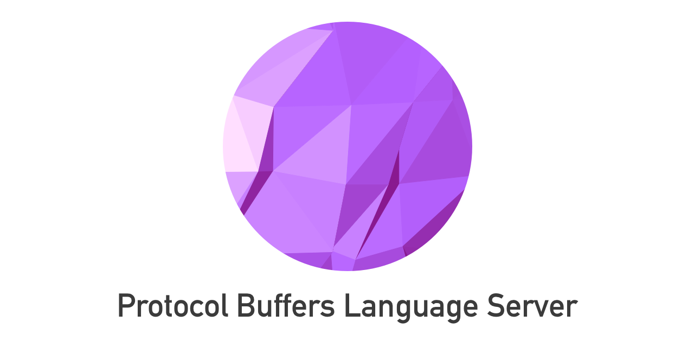

[![actions-workflow-test][actions-workflow-test-badge]][actions-workflow-test]
[![pkg.go.dev][pkg.go.dev-badge]][pkg.go.dev]
[![codefactor][codefactor-badge]][codefactor]
[![dependabot][dependabot-badge]][dependabot]
[![license][license-badge]][license]

**WARNING**:
This repository is in active development.
There are no guarantees about stability.
Breaking changes will occur until a stable release is made and announced.

[Language Server](https://langserver.org/) for [Protocol Buffers](https://developers.google.com/protocol-buffers/).

## Development

See [Development Guide](./docs/development.md).

## Contribution

See [Contribution Guide](./CONTRIBUTING.md).

## Reference

- [Langserver.org](https://langserver.org/)
- [Official page for Language Server Protocol](https://microsoft.github.io/language-server-protocol/)
- [Protocol Buffers  |  Google Developers](https://developers.google.com/protocol-buffers/)

## Author

[@micnncim](https://github.com/micnncim)

## License

Copyright 2019 The Protocol Buffers Language Server Authors.

Protocol Buffers Language Server is released under the [Apache License 2.0](./LICENSE).

<!-- badge links -->

[actions-workflow-test]: https://github.com/micnncim/protocol-buffers-language-server/actions?query=workflow%3ATest
[actions-workflow-test-badge]: https://img.shields.io/github/workflow/status/micnncim/protocol-buffers-language-server/Test?label=Test&style=for-the-badge&logo=github

[pkg.go.dev]: https://pkg.go.dev/github.com/micnncim/protocol-buffers-language-server?tab=overview
[pkg.go.dev-badge]: https://img.shields.io/badge/pkg.go.dev-reference-02ABD7?style=for-the-badge&logoWidth=25&logo=data%3Aimage%2Fsvg%2Bxml%3Bbase64%2CPHN2ZyB4bWxucz0iaHR0cDovL3d3dy53My5vcmcvMjAwMC9zdmciIHZpZXdCb3g9Ijg1IDU1IDEyMCAxMjAiPjxwYXRoIGZpbGw9IiMwMEFERDgiIGQ9Ik00MC4yIDEwMS4xYy0uNCAwLS41LS4yLS4zLS41bDIuMS0yLjdjLjItLjMuNy0uNSAxLjEtLjVoMzUuN2MuNCAwIC41LjMuMy42bC0xLjcgMi42Yy0uMi4zLS43LjYtMSAuNmwtMzYuMi0uMXptLTE1LjEgOS4yYy0uNCAwLS41LS4yLS4zLS41bDIuMS0yLjdjLjItLjMuNy0uNSAxLjEtLjVoNDUuNmMuNCAwIC42LjMuNS42bC0uOCAyLjRjLS4xLjQtLjUuNi0uOS42bC00Ny4zLjF6bTI0LjIgOS4yYy0uNCAwLS41LS4zLS4zLS42bDEuNC0yLjVjLjItLjMuNi0uNiAxLS42aDIwYy40IDAgLjYuMy42LjdsLS4yIDIuNGMwIC40LS40LjctLjcuN2wtMjEuOC0uMXptMTAzLjgtMjAuMmMtNi4zIDEuNi0xMC42IDIuOC0xNi44IDQuNC0xLjUuNC0xLjYuNS0yLjktMS0xLjUtMS43LTIuNi0yLjgtNC43LTMuOC02LjMtMy4xLTEyLjQtMi4yLTE4LjEgMS41LTYuOCA0LjQtMTAuMyAxMC45LTEwLjIgMTkgLjEgOCA1LjYgMTQuNiAxMy41IDE1LjcgNi44LjkgMTIuNS0xLjUgMTctNi42LjktMS4xIDEuNy0yLjMgMi43LTMuN2gtMTkuM2MtMi4xIDAtMi42LTEuMy0xLjktMyAxLjMtMy4xIDMuNy04LjMgNS4xLTEwLjkuMy0uNiAxLTEuNiAyLjUtMS42aDM2LjRjLS4yIDIuNy0uMiA1LjQtLjYgOC4xLTEuMSA3LjItMy44IDEzLjgtOC4yIDE5LjYtNy4yIDkuNS0xNi42IDE1LjQtMjguNSAxNy05LjggMS4zLTE4LjktLjYtMjYuOS02LjYtNy40LTUuNi0xMS42LTEzLTEyLjctMjIuMi0xLjMtMTAuOSAxLjktMjAuNyA4LjUtMjkuMyA3LjEtOS4zIDE2LjUtMTUuMiAyOC0xNy4zIDkuNC0xLjcgMTguNC0uNiAyNi41IDQuOSA1LjMgMy41IDkuMSA4LjMgMTEuNiAxNC4xLjYuOS4yIDEuNC0xIDEuN3oiLz48cGF0aCBmaWxsPSIjMDBBREQ4IiBkPSJNMTg2LjIgMTU0LjZjLTkuMS0uMi0xNy40LTIuOC0yNC40LTguOC01LjktNS4xLTkuNi0xMS42LTEwLjgtMTkuMy0xLjgtMTEuMyAxLjMtMjEuMyA4LjEtMzAuMiA3LjMtOS42IDE2LjEtMTQuNiAyOC0xNi43IDEwLjItMS44IDE5LjgtLjggMjguNSA1LjEgNy45IDUuNCAxMi44IDEyLjcgMTQuMSAyMi4zIDEuNyAxMy41LTIuMiAyNC41LTExLjUgMzMuOS02LjYgNi43LTE0LjcgMTAuOS0yNCAxMi44LTIuNy41LTUuNC42LTggLjl6bTIzLjgtNDAuNGMtLjEtMS4zLS4xLTIuMy0uMy0zLjMtMS44LTkuOS0xMC45LTE1LjUtMjAuNC0xMy4zLTkuMyAyLjEtMTUuMyA4LTE3LjUgMTcuNC0xLjggNy44IDIgMTUuNyA5LjIgMTguOSA1LjUgMi40IDExIDIuMSAxNi4zLS42IDcuOS00LjEgMTIuMi0xMC41IDEyLjctMTkuMXoiLz48L3N2Zz4=

[codefactor]: https://www.codefactor.io/repository/github/micnncim/protocol-buffers-language-server
[codefactor-badge]: https://img.shields.io/codefactor/grade/github/micnncim/protocol-buffers-language-server?logo=codefactor&style=for-the-badge

[dependabot]: https://github.com/micnncim/protocol-buffers-language-server/pulls?q=is:pr%20author:app/dependabot-preview
[dependabot-badge]: https://img.shields.io/badge/dependabot-enabled-blue?style=for-the-badge&logo=dependabot

[license]: LICENSE
[license-badge]: https://img.shields.io/github/license/micnncim/protocol-buffers-language-server?style=for-the-badge

